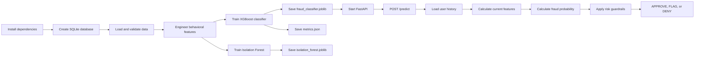

# Project Workflow

## 1. Purpose

The Predictive Risk and Fraud Analytics Framework is a small end-to-end transaction risk system. It demonstrates how transaction data can be loaded, validated, transformed into behavioral signals, scored by machine-learning models, and exposed through an HTTP API.

The repository is designed as a reproducible local demonstration. The included dataset is deterministic and contains 20 users, 660 transactions, and 60 fraud labels. Its metrics validate the pipeline rather than represent production performance.

## 2. End-to-End Flow



The workflow has two related paths:

1. **Training path:** create data, validate it, engineer features, train models, and save artifacts.
2. **Serving path:** receive an API request, enrich it with database history, calculate the same features, and return a risk decision.

The feature column order must remain the same in both paths:

```text
amount
 time_since_last_txn
 daily_txn_count
 amount_vs_average
 country_mismatch
```

## 3. Repository Components

```text
src/
├── api/main.py                 FastAPI application and /predict endpoint
├── features/engineering.py     Behavioral feature calculations
├── models/train.py             Model training and metric generation
└── pipelines/
    ├── db_setup.py             SQLite schema and deterministic seed data
    └── ingestion.py            Database loading and quality checks

tests/
├── test_environment.py         Dependency import check
├── test_pipelines.py           Database and data-quality tests
├── test_features.py            Feature behavior tests
├── test_models.py              Artifact and metric tests
└── test_api.py                 API and risk-decision tests

data/                           Local database location
artifacts/                      Generated model files and metrics
README.md                       Quick-start documentation
copilot.md                      Implementation and validation work log
docs/PROJECT_WORKFLOW.md        This complete workflow reference
```

## 4. Environment Setup

The project uses a Python virtual environment. From the repository root:

```bash
python3 -m venv .venv
./.venv/bin/python -m pip install -r requirements.txt
```

Use the explicit `.venv/bin` paths when the shell activation command is unavailable or fails. The project does not require a globally installed Python package.

## 5. Database Creation

Run:

```bash
./.venv/bin/python -m src.pipelines.db_setup
```

This creates `data/transactions.db` and replaces the two local tables on each run:

### `users`

| Column | Meaning |
| --- | --- |
| `user_id` | Stable user identifier |
| `country` | User's home country |
| `account_age_days` | Age of the account in days |

### `transactions`

| Column | Meaning |
| --- | --- |
| `transaction_id` | Stable transaction identifier |
| `user_id` | User who made the transaction |
| `amount` | Transaction amount |
| `timestamp` | ISO-formatted transaction time |
| `country` | Country associated with the transaction |
| `is_fraud` | Training label: `0` normal, `1` fraud |

The seed generator creates 600 normal transactions across 20 users and injects 60 fraud transactions across 10 users. Fraud cases mix obvious high-value, high-velocity country mismatches with subtler cases that resemble normal activity.

## 6. Ingestion and Data Quality

`DataPipeline` in `src/pipelines/ingestion.py` reads the tables with pandas and normalizes the input:

1. Read the `transactions` table from SQLite.
2. Parse `timestamp` values as UTC datetimes.
3. Convert `amount` values to numeric values.
4. Set `quality_flag` for missing amounts, invalid timestamps, or negative amounts.
5. Remove flagged rows when loading the clean training data.

The pipeline also exposes `load_users()` for API context enrichment.

## 7. Feature Engineering

`add_transaction_features()` sorts each user's transactions by timestamp and adds four behavioral signals:

- **`time_since_last_txn`**: elapsed hours since the previous transaction for the same user. The first known transaction uses `999.0` as a sentinel.
- **`daily_txn_count`**: number of that user's transactions in the surrounding 24-hour time window.
- **`amount_vs_average`**: current amount divided by the user's previous expanding average. The first transaction and zero-average cases use `1.0`.
- **`country_mismatch`**: `1` when the transaction country differs from `home_country`; otherwise `0`.

`model_features()` keeps the five numeric model columns, replaces infinite values, and fills missing values with zero.

## 8. Model Training

Run:

```bash
./.venv/bin/python -m src.models.train
```

Training performs these steps:

1. Load clean transactions from `data/transactions.db`.
2. Build the numeric feature matrix.
3. Fit an **Isolation Forest** for unsupervised anomaly detection.
4. Split labeled data into a stratified training and evaluation set.
5. Fit an **XGBoost classifier** for supervised fraud probability.
6. Evaluate precision, recall, F1, and ROC-AUC.
7. Save reusable artifacts in `artifacts/`.

Generated files:

| File | Purpose |
| --- | --- |
| `artifacts/fraud_classifier.joblib` | Classifier used by the API |
| `artifacts/isolation_forest.joblib` | Unsupervised anomaly model |
| `artifacts/metrics.json` | Evaluation metrics from the seeded holdout |

The evaluation threshold is `0.9`, which produces a realistic precision-recall tradeoff on the mixed synthetic cases. The current seeded holdout reports precision `0.923`, recall `0.667`, F1 `0.774`, and ROC-AUC `0.923`; these metrics are not production performance guarantees.

The current XGBoost feature importance profile is led by behavioral signals rather than raw amount: `time_since_last_txn` is about `0.476`, `daily_txn_count` about `0.327`, `amount` about `0.105`, and `amount_vs_average` about `0.092`. Country mismatch is retained as an explicit API guardrail because a binary location signal should not be allowed to disappear behind a tree split.

## 9. API Serving

Start the application after database creation and model training:

```bash
./.venv/bin/uvicorn src.api.main:app --host 127.0.0.1 --port 8000
```

Open `http://127.0.0.1:8000/` for the Sentinel Risk Desk web interface. The page is a browser client for `/predict` and includes sample scenarios, transaction inputs, a risk meter, decision guidance, and an in-session history list.

Endpoints:

- `GET /`: Sentinel Risk Desk web interface.
- `GET /health`: service health response.
- `GET /docs`: interactive Swagger UI.
- `POST /predict`: transaction risk scoring.

Example request:

```bash
curl -X POST http://127.0.0.1:8000/predict \
  -H 'Content-Type: application/json' \
  -d '{"user_id":"u003","amount":2500,"timestamp":"2030-01-01T10:00:00Z","country":"NG"}'
```

Example response:

```json
{"risk_score":0.75,"action":"DENY"}
```

### `/predict` processing sequence

1. Validate the request with Pydantic.
2. Confirm that `artifacts/fraud_classifier.joblib` exists.
3. Load the user's existing transactions from SQLite.
4. Look up the user's home country.
5. Append the incoming transaction to that user's history.
6. Generate the current transaction's five model features.
7. Calculate the XGBoost fraud probability.
8. Apply transparent high-signal guardrails:
   - Amount at least twice the historical average plus a country mismatch raises severity to `DENY`.
  - A country mismatch by itself raises severity to `FLAG`.
   - At least four transactions in the 24-hour window raises severity to at least `FLAG`.
9. Map the final score to an action:
   - Below `0.35`: `APPROVE`
   - `0.35` to below `0.75`: `FLAG`
   - `0.75` or higher: `DENY`

If the database or artifacts are missing, the service must be initialized with the setup and training commands before `/predict` can work.

## 10. Testing and Validation

Run all tests with:

```bash
./.venv/bin/pytest tests/ -q
```

The test suite verifies:

- Required libraries import successfully.
- SQLite tables are created.
- Invalid critical transaction rows are flagged and excluded.
- Velocity and ratio features handle normal and zero-average inputs.
- Model artifacts and bounded metrics are generated.
- The root health route works.
- Normal API requests return a valid action and meet the latency check.
- Suspicious transactions are escalated to `FLAG` or `DENY`.

A clean repository check is:

```bash
git diff --check
git status --short --branch
```

## 11. Common Issues

### The browser shows `{"detail":"Not Found"}`

The server is probably running older code, or the application was started before the `GET /` route was added. Stop the existing Uvicorn process and restart it from the repository root:

```bash
./.venv/bin/uvicorn src.api.main:app --host 127.0.0.1 --port 8000
```

### Port 8000 is already in use

Use the existing service if it is the current application, or start a second instance on another port:

```bash
./.venv/bin/uvicorn src.api.main:app --host 127.0.0.1 --port 8001
```

Then use `http://127.0.0.1:8001/docs` and update the curl URL accordingly.

### The shell cannot activate `.venv`

Activation is optional. Use direct executable paths such as `./.venv/bin/python`, `./.venv/bin/pytest`, and `./.venv/bin/uvicorn`.

### `/predict` returns HTTP 503

The classifier artifact is missing. Run database setup and model training again:

```bash
./.venv/bin/python -m src.pipelines.db_setup
./.venv/bin/python -m src.models.train
```

## 12. Recommended Production Extensions

This repository is a local framework demonstration. A production implementation would typically add:

- A managed database and streaming ingestion layer.
- Authentication, authorization, request tracing, and rate limiting.
- Feature storage for low-latency user history lookups.
- Time-based validation and larger representative training data.
- Model versioning, drift monitoring, explainability, and human review queues.
- Structured logging and alerts for model and API failures.
